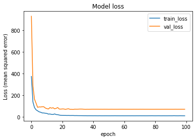
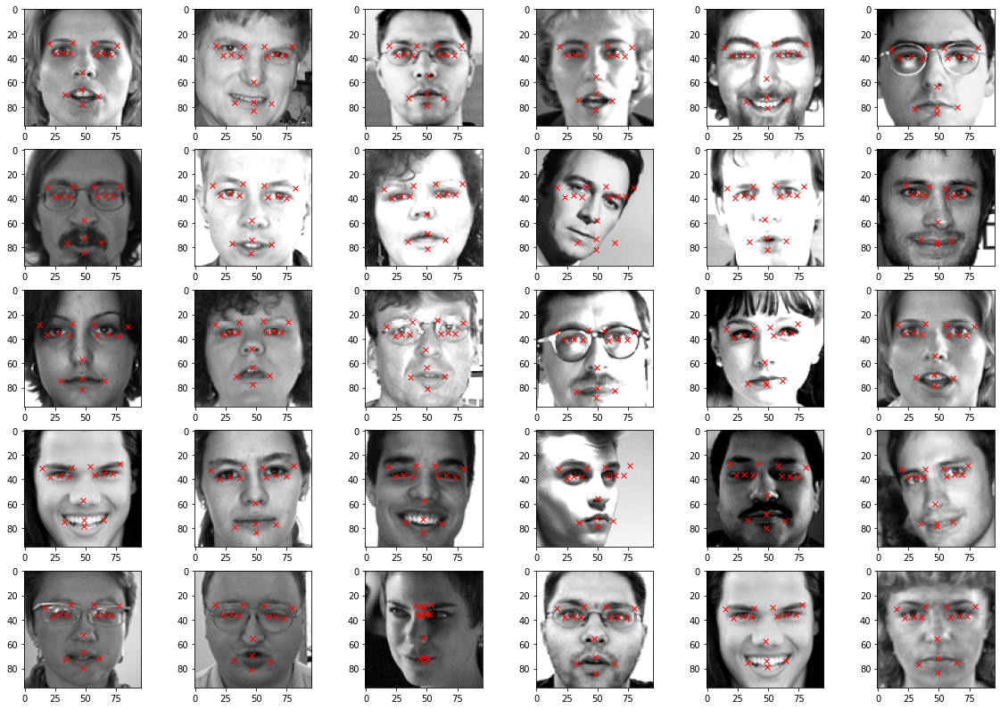
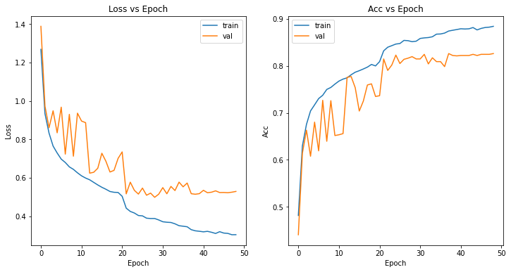
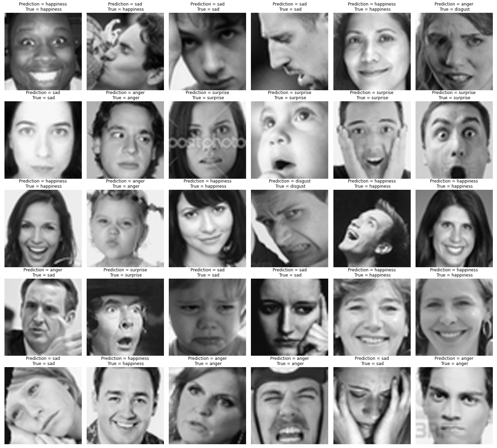
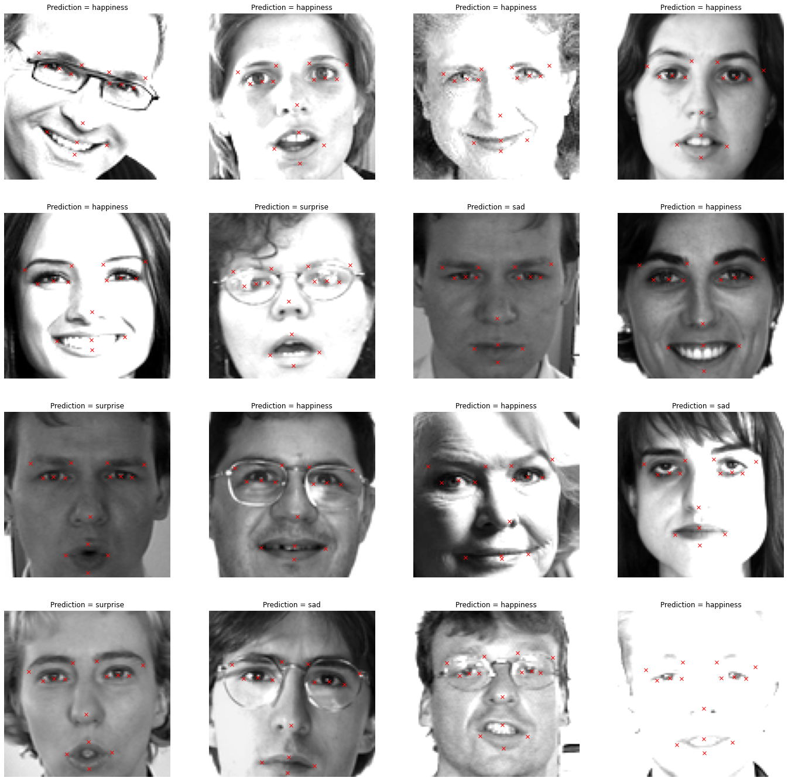

<h2 align=center> Facial Keypoints & Emotion Recogination</h2>

This project aims to recognize facial expression and landmarks with CNN implemented by Keras. I also implement a real-time module which can real-time capture user's face through webcam steaming called by opencv. OpenCV cropped the face it detects from the original frames and resize the cropped images to 96*96 grayscale image, then take them as inputs of deep leanring model. Moreover, this project also provides a function to combine users' spoken content and facial expression detected by our system to generate corresponding sentences with appropriate emotions which are 'angry', 'disgust', 'sad', 'happy', 'surprise'

DATA DESCRIPTION
------
* fACIAL KEYPOINTS DATA

This data belong to [kaggle competation](https://www.kaggle.com/c/facial-keypoints-detection/overview).
Each predicted keypoint is specified by an (x,y) real-valued pair in the space of pixel indices. There are 15 keypoints, which represent the following elements of the face:

left_eye_center, right_eye_center, left_eye_inner_corner, left_eye_outer_corner, right_eye_inner_corner, right_eye_outer_corner, left_eyebrow_inner_end, left_eyebrow_outer_end, right_eyebrow_inner_end, right_eyebrow_outer_end, nose_tip, mouth_left_corner, mouth_right_corner, mouth_center_top_lip, mouth_center_bottom_lip

Left and right here refers to the point of view of the subject.

In some examples, some of the target keypoint positions are misssing (encoded as missing entries in the csv, i.e., with nothing between two commas).

The input image is given in the last field of the data files, and consists of a list of pixels (ordered by row), as integers in (0,255). The images are 96x96 pixels.

* fACIAL EXPRESSION DATA

The data consists of 48x48 pixel grayscale images of faces. The faces have been automatically registered so that the face is more or less centered and occupies about the same amount of space in each image. The task is to categorize each face based on the emotion shown in the facial expression in to one of five categories {0:'anger', 1:'disgust', 2:'sad', 3:'happiness', 4: 'surprise'}. This data is edited from [kaggle competatiton FER2013](https://www.kaggle.com/c/challenges-in-representation-learning-facial-expression-recognition-challenge/overview)

**GET CSV FILE of DATA HERE:** [emotion data](https://drive.google.com/file/d/10EG3b9PMNpImjCWP3239VjEN6mQVLpCp/view?usp=sharing), [keypoints data](https://drive.google.com/file/d/10BZytrH7WCbYQ8H-lC2sypxNTqsrrKB1/view?usp=sharing)

For building final pipe line the expression dataset images are also increased to 96*96 pixels using opencv, as keypoints model was trained on this size only

Dependencies
---------
* Python 3.8
* Pandas 
* Tensorflow 2.2
* Keras
* Matplotlib
* Seaborn
* Numpy

RESULTS
-------
- **Keypoints Model** - (train for 100 epochs)

Epoch End Result - loss: 8.9081 - root_mean_squared_error: 2.9846 - val_loss: 69.5729 - val_root_mean_squared_error: 8.3410

Test Set loss: 60.5931 - root_mean_squared_error: 7.7842

- **Expression Model** - (train for 50 epochs)

Epoch End Result - loss: 0.3036 - accuracy: 0.8837 - val_loss: 0.5288 - val_accuracy: 0.8259

Accuracy on test set 81.19 %

- Expression and Keypoints Model Pipeline

